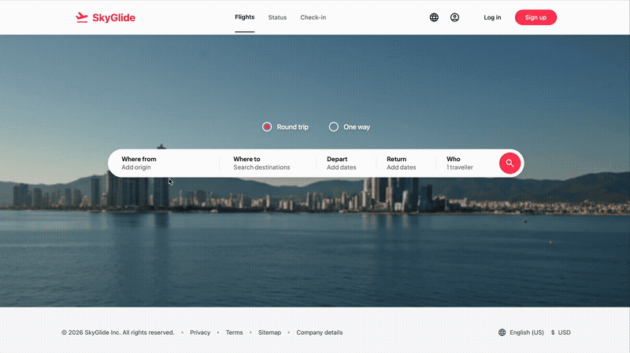

# Bookings

Toy flight-booking app on top of the [Postgres Pro public demo airline schema](https://postgrespro.ru/education/demodb)
(flattened, jsonb-i18n removed). Spring Boot 4 + Java 25 backend, React + Vite
frontend, PostgreSQL 17. OpenAPI spec lives at `api.yaml`; the FE generates
its types from it (`frontend/src/shared/api/schema.ts`).

For setup, demo-data loading, and the two-database layout see
[`backend/README.md`](backend/README.md).



## What's implemented

### HTTP API

| Method | Path                          | Purpose                                          |
|--------|-------------------------------|--------------------------------------------------|
| GET    | `/api/airports/search`        | Type-ahead by city, trigram-indexed              |
| POST   | `/api/flights/search`         | Itineraries with filters, sort, pricing          |
| GET    | `/api/flights/{flightId}/seats` | Seat map for one leg (cabin layout + taken seats) |
| POST   | `/api/bookings`               | Create a multi-leg booking with seat lock        |

Errors use RFC 7807 `ProblemDetail`; booking-time conflicts return `409` with
a `conflicts[]` extension. Cross-cutting handling in
`common/GlobalExceptionHandler.java`.

### Backend packages

```
com.defenestration.bookings
  airport/         GET /airports/search        — trigram autocomplete
  flightsearch/    POST /flights/search        — itinerary assembly from priced_leg_v
  seatmap/         GET /flights/{id}/seats     — cabin + seat availability
  booking/         POST /bookings              — book one passenger across N legs
  flight/          shared Flight read entity
  common/          FlightStatus enum, GlobalExceptionHandler
```

Persistence is **Spring Data JPA throughout** — entities for the few read
paths that benefit, native queries via `@Query` for everything search/booking
related (the SQL is the interesting part of those endpoints).

### Booking flow

`POST /api/bookings` accepts `{ passenger, legs: [{flightId, seatNo}], payment }`
and runs in one DB transaction:

1. `fetchLegPricing` — one round-trip via `UNNEST(:flightIds, :seatNos)
   WITH ORDINALITY` joined to flights → routes → airports → seats →
   `route_fares` → `airplane_price_factors`. Returns per-leg pricing **and**
   surfaces unknown flights, unknown seats, and non-bookable statuses in a
   single query.
2. Pre-check seat availability with `findTakenSeats`.
3. Insert into `bookings` → `tickets` → `segments` (one row per leg).
4. The `UNIQUE (flight_id, seat_no)` on `bookings.segments` is the real lock:
   if a concurrent booking takes the seat between step 2 and 3, the
   constraint violation is parsed and turned into a `409` with the offending
   `(flightId, seatNo)` — no advisory locks, no row-level locking.

## SQL schema (Flyway, `backend/src/main/resources/db/migration/`)

| File | What it adds |
|------|--------------|
| `V1__init_schema.sql` | Postgres Pro demo schema, flattened (no jsonb-i18n). 9 tables + `timetable` view + `bookings.now()` fixed at `2025-12-01` (demo "current time"). Adds `route_fares` and `airplane_price_factors` (not in upstream). |
| `V2__airport_search_indexes.sql` | `pg_trgm` + GIN index on `airports.city` for autocomplete. |
| `V3__flight_search_views.sql` | `flight_leg_v` (tz-resolved local date / minute-of-day per leg) and `priced_leg_v` (fanned out by fare class, `base_price × COALESCE(airplane_multiplier, 1.0)`). |
| `V4__aircraft_layouts.sql` | `aircraft_layouts(airplane_code, aisles_after text[])` — drives the seat-map renderer's aisle gaps. |
| `V5__flight_leg_v_bookable_only.sql` | Tightens `flight_leg_v` to `Scheduled/On Time/Delayed/Boarding`, matching `FlightStatus.BOOKABLE_SQL_VALUES`. |

### Schema notes worth knowing

- **Routes are keyed `(route_no, validity)`** with a `tstzrange` and a GiST
  exclusion constraint preventing overlap. A route_no can have multiple
  non-overlapping validity windows — joins always use `validity @> dep_at`.
- **`route_fares`** is keyed by `(route_no, fare_conditions)` with no FK to
  `routes` (because of the validity composite). One fare applies across all
  validity windows of a route_no.
- **`airplane_price_factors`** uses a `daterange` exclusion constraint to
  enforce non-overlap per airplane; the search query LEFT JOINs and
  `COALESCE`s missing rows to `1.0`.
- **`segments.UNIQUE (flight_id, seat_no)`** is the seat lock. No status
  column or "held" state — a row in `segments` *is* a booked seat.
- **Timezone strategy**: UTC stored in `flights.scheduled_*`; per-airport
  `airports.timezone` resolved inside views once (`AT TIME ZONE`) so per-query
  tz math is amortized. API returns UTC; the FE renders local with the airport
  tz also sent in the payload.

## Frontend

Vite + React + react-hook-form. FSD-style folders under `frontend/src/`
(`entities/`, `features/`, `shared/`). All API types are generated from
`api.yaml` into `shared/api/schema.ts` and re-exported from `entities/*/model`
— there are no hand-rolled DTO types on the FE side. See
[`frontend/DESIGN.md`](frontend/DESIGN.md) for the visual language.
